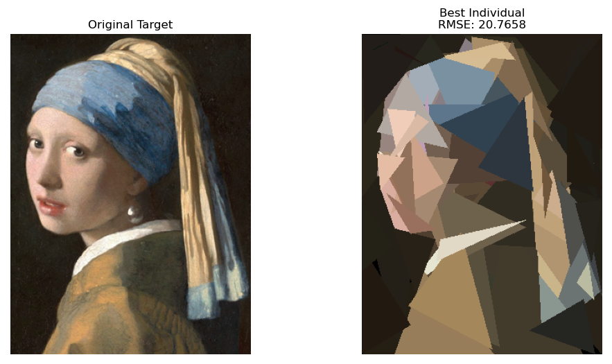
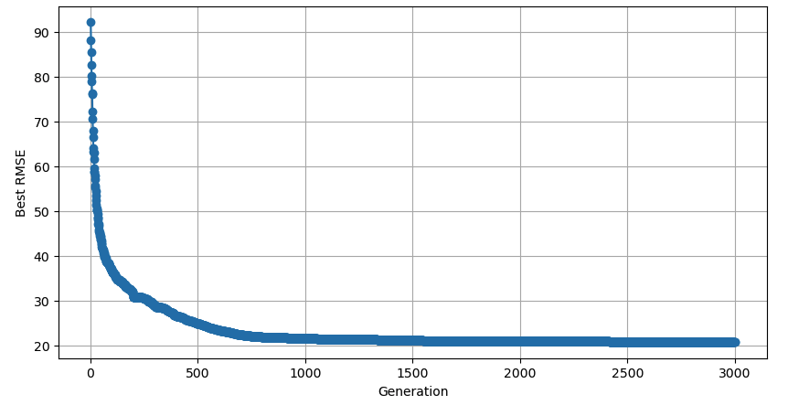
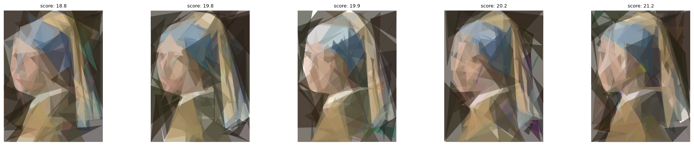
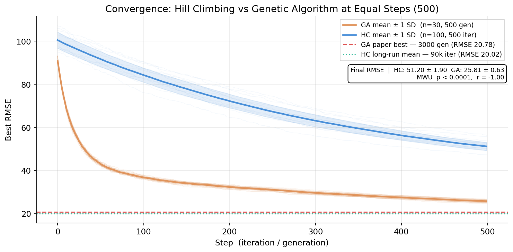

# Image Reconstruction with Genetic Algorithms
 
**Recreating Vermeer's *Girl with a Pearl Earring* with only 100 flat-colored triangles.**
 
A **Genetic Algorithm (GA)** evolves a population of candidate images, each made of an ordered list of 100 triangles, towards a target painting. As an additional challenge, the GA is compared against a customized **Hill Climbing (HC)** algorithm, with a full statistical analysis (30 GA runs, 100 HC runs, plus long HC runs).
 
> Course project for *Computational Intelligence for Optimization* at **NOVA Information Management School**.
> Professors: Leonardo Vanneschi, Samuel Santos.
> The full write-up is in [`Report.pdf`](Report.pdf).
 
<p align="center">
  
</p>
---
 
## Table of Contents
 
- [Overview](#overview)
- [Repository Structure](#repository-structure)
- [Getting Started](#getting-started)
- [Use Your Own Image](#use-your-own-image)
- [Playing with the Hyperparameters](#playing-with-the-hyperparameters)
- [How It Works](#how-it-works)
- [Results](#results)
- [Statistical Analysis](#statistical-analysis)
- [Authors](#authors)
- [References](#references)
---
 
## Overview

- Each **individual** is a complete candidate image: an ordered list of **100 triangles**, each defined by 3 vertices and an RGB color.

- Triangles are rendered sequentially, so later triangles can cover earlier ones. Layering lets both global structure and fine detail emerge.

- **Fitness** is the pixel-wise RGB **RMSE** against the target image (lower is better):

$$
\text{RMSE} = \sqrt{\frac{1}{N}\sum_{i=1}^{N}(I_i - G_i)^2}
$$
 
---
 
## Repository Structure
 
```
.
├── Genetic_algorithm.ipynb       # Full GA pipeline: init, selection, crossover, mutation, evolution
├── Hill_climbing.ipynb           # Long HC run (30k iterations x 5 individuals)
├── hill_functions.py             # HC helper functions imported by the HC notebook
├── Statistical_tests.py          # Statistical comparison HC vs GA (console report + 10 plots)
├── girl_pearl_earing.png         # Default target image
├── Report.pdf                    # Full project report
├── assets/                       # Figures used in this README
└── README.md
```
 
---
 
## Getting Started
 
### 1. Clone the repository
 
```bash
git clone https://github.com/LiberoBiagi/Image_Reconstruction_with_Genetic_Algorithms.git
cd Image_Reconstruction_with_Genetic_Algorithms
```
 
### 2. Install dependencies
 
```bash
pip install numpy pillow scipy pandas matplotlib openpyxl jupyter
```
 
`openpyxl` is only needed by `Statistical_tests.py` (it reads the GA results from Excel files).
 
### 3. Run the notebooks
 
```bash
jupyter notebook
```
 
| Notebook | What it does |
|---|---|
| `Genetic_algorithm.ipynb` | Builds the initial population, demonstrates selection / crossover / mutation, then evolves the population for 3000 generations and plots the best RMSE per generation. |
| `Hill_climbing.ipynb` | Builds a small population and runs the HC optimizer on each individual, then plots the fitness trajectories. |
 
Run the cells top to bottom. The notebooks expect `girl_pearl_earing.png` in the same folder.
 
> **Heads up:** runs are slow. A full GA run evaluates 500 individuals per generation for 3000 generations, and the long HC run took about 5 hours in total. For a quick test, lower `POP_SIZE` and `n_generations` (GA) or `max_iterations` (HC), or use a smaller image.
 
---
 
## Use Your Own Image
 
You are **not limited to the Vermeer painting**. To run either algorithm on another image:
 
1. Put your image in the project folder.
2. In the *Import image* cell of the notebook (`Genetic_algorithm.ipynb` and/or `Hill_climbing.ipynb`), change the file name:
```python
# Before
img = Image.open("girl_pearl_earing.png").convert("RGB")
 
# After
img = Image.open("my_image.png").convert("RGB")
```
 
3. Re-run the notebook from the top. Image width and height (`w`, `h`) are read automatically from the file, and the fitness function, rendering and evolution adapt to the new target.
**Tips**
 
- Images with large, distinct color regions (portraits, logos, landscapes, flat illustrations) work best with a small triangle budget.
- Very detailed images (text, fine textures) need many more triangles to look good.
- Smaller images are much faster, because every fitness evaluation renders and compares the whole image. Consider resizing large images first.
---
 
## Playing with the Hyperparameters
 
Everything is meant to be tweaked. The tables below list what you can change and where.
 
### Genetic Algorithm (`Genetic_algorithm.ipynb`)
 
| Hyperparameter | Default | Where | Effect |
|---|---|---|---|
| `N_TRIANGLES` | 100 | First Run cell | Triangles per individual. More triangles give more detail but a larger search space. |
| `POP_SIZE` | 500 | First Run cell | Population size. Larger means more diversity but slower generations. |
| `n_generations` | 3000 | `evolve_population(...)` call | Length of the evolution. |
| `tournament_size` | 10 | `evolve_population(...)` call | Higher means stronger selection pressure. |
| `DX_START` / `DX_END` | 0.55 / 0.05 | `generate_initial_population` | Max triangle spread at initialization (fraction of image size), shrinking from the first to the last triangle. |
| `AREA_START` / `AREA_END` | 0.04 / 0.001 | `generate_initial_population` | Minimum triangle area at initialization (fraction of image area). |
| Mutation rate | 0.25 → 0.08 | `get_mutation_params` | Probability of mutating each triangle, linearly annealed. |
| Annealing length | 1000 generations | `get_mutation_params` | How fast the mutation parameters decay. |
| Vertex step | 10 → 2 px | `get_mutation_params` | Max vertex displacement. |
| Color step | 40 → 8 | `get_mutation_params` | Max RGB perturbation. |
| Color vs. geometry mutation | 70% / 30% | `mutate` | Probability that a mutation changes color rather than vertices. |
| `grid_size` | 6 | `crossover` | Resolution of the coverage-aware crossover grid. |
 
Elitism keeps the single best individual of each generation unchanged. To keep more, edit `new_pop` in `evolve_population`.
 
### Hill Climbing (`Hill_climbing.ipynb`, `Hill_climbing_functions.py`)
 
| Hyperparameter | Default | Where | Effect |
|---|---|---|---|
| `N_TRIANGLES` | 100 | First cell of Exhaustive Run | Triangles per individual. |
| `POP_SIZE` | 5 | First cell of Exhaustive Run | Number of independent HC runs (individuals). |
| `max_iterations` | 30000 | `hill_climb_population(...)` call | Iterations per restart. |
| `patience` | 30000 | `hill_climb_population(...)` call | Iterations without improvement before stopping a restart. It also controls how fast the step size shrinks. |
| `n_restarts` | 3 | `hill_climb_population(...)` call | Number of restart phases. With the defaults, one individual runs up to 3 x 30,000 = 90,000 iterations. |
| `n_candidates` | 5 | `hill_climb_population(...)` call | Neighbors evaluated per iteration (best-of-k). |
| `top_k` | 5 | `hill_climb_population(...)` call | Number of best individuals returned. |
| `step_geo` / `step_color` | 20 px / 40 | `hill_climb_individual` | Initial neighbor step sizes (adaptive: they shrink when the search stagnates). |
| `adaptive_step` | `True` | `hill_climb_individual` | Turns the shrinking step size on or off. |
| `use_multi_tri` | `True` | `hill_climb_individual` | Allows moves that change several triangles at once. |
| Multi-triangle probability | 30% | `hill_climb_individual` | Chance of a multi-triangle move (`n_tri=2`). |
| Perturbation strength | ~20% of triangles, ±40 px, ±60 color | `_perturb` | How violent the jump is at each restart. It grows with the restart number. |
 
### Things to try
 
- **Exploration vs. exploitation:** raise the starting mutation rate and step sizes for more exploration, or lower them for faster fine-tuning.
- **Selection pressure:** compare tournament sizes 3, 5 and 10.
- **Representation budget:** try 50, 200 or 500 triangles and see how the detail changes.
- **Population vs. generations:** same total budget, different splits (for example 100 individuals for 15,000 generations vs. 500 for 3,000).
- **Initialization:** change `DX_START`, `DX_END` and the area bounds. In our grid search, the initial spread (`dx_start`) had a statistically significant effect on the final error.
- **HC restarts:** change `n_restarts` and the perturbation strength to see how often HC escapes local optima.
---
 
## How It Works
 
### Genetic Algorithm
 
| Component | Description |
|---|---|
| **Initialization** | 500 individuals x 100 triangles. Base points are sampled with higher probability in regions covered less often (coverage map). Coarse-to-fine: early triangles are larger, later ones smaller. Colors are fully random (target-derived colors reduced diversity in preliminary experiments). |
| **Selection** | Tournament selection on RMSE (size 10). |
| **Crossover** | Triangle-level crossover: each position is inherited from one of the two parents. A coverage-aware step on a 6x6 grid favors triangles whose center falls in a cell not yet used by the child. Remaining positions are filled from either parent. |
| **Mutation** | Per-triangle. 70% of mutations perturb the color, 30% shift the vertices. Rate, vertex step and color step are annealed over generations (see the table above). |
| **Elitism** | The best individual is copied unchanged into the next generation. |
 
### Hill Climbing
 
| Component | Description |
|---|---|
| **Neighborhood** | Pick a triangle and apply either a geometry move (shift vertices) or a color move (perturb RGB). With 30% probability, two triangles are modified at once to make larger jumps. |
| **Best-of-k** | At each iteration, `n_candidates` neighbors are evaluated and the best one is accepted if it improves the current solution. |
| **Adaptive step** | Step sizes shrink when the search has not improved for a while. |
| **Escaping local optima** | Restart with perturbation: restart from the best solution found so far after applying a strong perturbation to about 20% of triangles. The intensity grows with every consecutive restart. |
 
---
 
## Results
 
### Genetic Algorithm
 
The best RMSE drops from **92.15** to **36.35** in the first 100 generations, then slowly refines to **20.78** after 3000 generations.
 
| Generation | Best RMSE | Mean RMSE |
|---|---|---|
| 1 | 92.15 | 100.88 |
| 100 | 36.35 | 38.73 |
| 500 | 24.85 | 25.55 |
| 1000 | 21.60 | 21.73 |
| 2000 | 21.01 | 21.16 |
| 3000 | 20.78 | 20.92 |
 
<p align="center">
  
</p>

#### Hill Climbing
 
The long HC run recovers recognizable facial structure and even the pearl earring (RMSE of the five best solutions between about 18.8 and 21.2).
 
<p align="center">
  
</p>

#### GA vs. HC
 
| Condition | Runs | Steps | Mean final RMSE |
|---|---|---|---|
| HC, 500 iterations | 100 | 500 | 51.20 ± 1.90 |
| GA, 500 generations | 30 | 500 | 25.81 ± 0.63 |
| HC, 90k iterations | 5 | 90,000 | 20.02 ± 0.87 |
| GA, 3000 generations | 1 | 3,000 | 20.78 |
 
<p align="center">
  
</p>
- At an equal number of steps (500), **every GA run beats every HC run**.
- Given a much larger budget, HC reaches a quality comparable to the 3000-generation GA, with a considerably smaller number of fitness evaluations (a GA generation evaluates the whole population of 500).
- **Takeaway:** if the number of steps is the constraint, the GA is preferable. If total compute is the constraint, HC can be more efficient. This is consistent with the No Free Lunch theorem.
---
 
## Statistical Analysis
 
[`Statistical_tests.py`](Statistical_tests.py) runs the full statistical pipeline described in the report and prints a console report. It also saves 10 figures (convergence curves, box plots, Q-Q plots, permutation test, bootstrap CIs, Kruskal-Wallis, AUC, evaluation efficiency, grid search) to an output folder.
 
```bash
python Statistical_tests.py
```
 
**Input files.** The script reads its data from the files listed in the `CONFIGURATION` block at the top of the script (edit the paths there if your files are elsewhere):
 
| Variable | Default file | Content |
|---|---|---|
| `HC_SHORT_LOG` | `fitness_log_hill.csv` | 100 HC runs x 500 iterations (an `iteration` column plus one column per run) |
| `HC_LONG_LOG` | `fitness_log.csv` | 5 long HC runs (90,000 iterations) |
| `GA_SEED_GLOB` | `evolution_results_seed_*.xlsx` | 30 GA runs x 500 generations (one Excel file per seed, with a `fitness` column) |
| `GRID_SEARCH` | `repeated_grid_search_results.csv` | Initialization grid search (`dx_start`, `dx_end`, `area_start`, `area_end`, `avg_error`) |
 
**Output folder.** Set `OUTPUT_DIR` in the same block (for example `OUTPUT_DIR = "plots"`). The folder is created automatically.
 
**Tests performed** (on final RMSE values: HC n = 100, GA n = 30, HC-90k n = 5):
 
- **Normality:** Shapiro-Wilk, D'Agostino-Pearson.
- **Equal variances:** Levene's test (justifies Welch's t-test).
- **HC-500 vs. GA-500:** Mann-Whitney U (primary), Welch's t-test with Cohen's d, Kolmogorov-Smirnov, and a 10,000-resample permutation test. All p < 0.0001.
- **Three-group comparison:** Kruskal-Wallis plus Bonferroni-corrected pairwise Mann-Whitney tests. All pairs p < 0.001.
- **Extras:** bootstrap 95% confidence intervals, area-under-the-convergence-curve metric, and a Spearman analysis of the initialization grid search.
Full tables, diagnostics and figures are in [`Report.pdf`](Report.pdf) (Appendices B to D).
 
---
 
## Authors
 
| Name | Student ID |
|---|---|
| Andreea Roica | 20250361 |
| Carlos Amorim | 20211548 |
| Libero Biagi | 20250349 |
| Oliver Kain | 20250401 |
 
NOVA Information Management School, May 2026.
 
---
 
## References
 
1. D. E. Goldberg. *Genetic Algorithms in Search, Optimization, and Machine Learning*. Addison-Wesley, 1989.
2. S. Russell and P. Norvig. *Artificial Intelligence: A Modern Approach*, 4th ed. Pearson, 2020.
3. L. Vanneschi and S. Silva. *Lectures on Intelligent Systems*. Springer, 2023.
4. D. H. Wolpert and W. G. Macready. No free lunch theorems for optimization. *IEEE Transactions on Evolutionary Computation*, 1(1):67–82, 1997.
